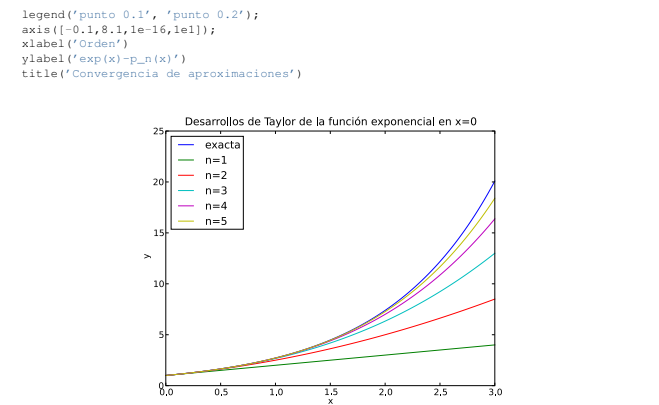

# Computación para Física Médica
## Repositorio de Ejercicios

Este repositorio contiene una colección de ejercicios desarrollados en MATLAB como parte de la materia de Computación de la carrera de Física Médica. El objetivo de estos ejercicios es aplicar los conocimientos de programación en MATLAB para resolver problemas relevantes en el campo de la física médica.
Tambien se pueden encontrar ejercicios en C.

